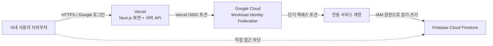

# Vercel + Firebase 사내 웹앱 구축·배포 가이드

> 이 문서는 현재 연차 관리 시스템 저장소의 실제 구성을 바탕으로, 다른 회사가 비슷한 사내 웹앱을 만들고 배포할 때 참고할 수 있도록 정리한 공유용 자료입니다. 계정명, 도메인, 프로젝트 ID와 비밀값은 각 회사의 값으로 바꿔야 합니다.

- 기준일: 2026-08-06
- 예시 앱: Next.js 기반 사내 업무 웹앱
- 배포: Vercel
- 데이터베이스: Firebase Cloud Firestore
- 운영 인증: Vercel OIDC + Google Cloud Workload Identity Federation

## 1. 한눈에 보는 진행 방식

실제 작업은 아래 순서로 진행했습니다.

1. 필요한 화면, 사용자 권한, 승인 흐름과 저장할 데이터를 먼저 정의했습니다.
2. Next.js로 화면과 서버 API를 한 프로젝트 안에 구현했습니다.
3. Firebase 프로젝트와 Firestore 데이터베이스를 만들고 초기 데이터를 넣었습니다.
4. 로컬에서는 데모 모드와 Google Application Default Credentials로 기능을 확인했습니다.
5. Git 저장소를 Vercel에 연결하고, 앱 폴더인 `web`을 Root Directory로 지정했습니다.
6. Vercel 환경변수와 Google OAuth 콜백 주소를 등록했습니다.
7. 운영 서버가 Firestore에 접속할 때 장기 서비스 계정 키를 저장하지 않도록 Vercel OIDC와 Google Cloud Workload Identity Federation을 연결했습니다.
8. 운영 도메인을 연결한 뒤 로그인, 조회, 등록, 수정, 권한 차단과 로그를 점검했습니다.

핵심은 **브라우저가 Firestore에 직접 접속하지 않고, 모든 데이터 요청이 Vercel의 Next.js 서버 API를 거치도록 한 것**입니다.

## 2. 전체 구조



| 구분 | 이 프로젝트에서 사용한 방식 | 이유 |
|---|---|---|
| 프론트엔드 | Next.js 16, React 19 | 화면과 서버 API를 한 저장소에서 관리 |
| 서버 | Next.js Route Handlers, Vercel Functions | 별도 서버 운영 없이 API 실행 |
| 데이터 | Firebase Cloud Firestore | 문서형 데이터 저장, 관리 콘솔, 트랜잭션 지원 |
| 사용자 로그인 | Google OAuth, 회사 도메인 제한 | 사내 Google 계정만 접근 |
| 서버 인증 | Vercel OIDC + Workload Identity Federation | 장기 서비스 계정 키를 Vercel에 저장하지 않음 |
| 권한 관리 | 앱 내부 권한 + Google Cloud IAM | 사용자 기능 권한과 서버의 DB 권한을 분리 |

## 3. 시작 전에 결정한 것

클라우드 설정부터 시작하기보다 아래 항목을 먼저 정하면 재작업이 줄어듭니다.

- 누가 사용하는가: 전체 직원, 관리자, 팀장 등
- 누가 어떤 데이터를 조회·수정할 수 있는가
- 승인, 반려, 취소 같은 상태가 어떤 순서로 바뀌는가
- 감사 로그와 실패 로그를 얼마나 남길 것인가
- 회사 Google Workspace 계정만 로그인시킬 것인가
- 운영, 미리보기, 로컬 환경의 데이터를 분리할 것인가
- 개인정보, 퇴사자 데이터, 백업과 보관 기간을 어떻게 관리할 것인가

이 프로젝트는 직원, 팀, 신청, 원장, 포상 지급, 알림, 감사 기록 등을 별도 Firestore 컬렉션으로 나눴습니다. 데이터 구조는 화면보다 먼저 설계하고, 금액·잔액·승인처럼 중요한 변경은 트랜잭션과 감사 기록을 함께 적용했습니다.

## 4. 프로젝트 코드 구성

현재 저장소는 아래처럼 루트와 실제 웹앱 폴더가 분리되어 있습니다.

```text
team-management-main/
├── package.json                 # 루트 실행 명령
├── README.md                    # 전체 기능과 운영 설정
├── docs/                        # 데이터 구조와 공유 문서
├── web/                         # 실제 Next.js 앱 - Vercel Root Directory
│   ├── app/                     # 화면, API, 서버 로직
│   ├── scripts/                 # Firestore 초기화 스크립트
│   ├── .env.example             # 필요한 환경변수 예시
│   └── package.json
└── google-apps-script/          # 선택 기능: 캘린더·메일 연동
```

Vercel이 저장소 최상위가 아니라 `web` 폴더를 빌드하게 해야 합니다. 이 설정이 다르면 패키지를 찾지 못하거나 엉뚱한 빌드 명령이 실행될 수 있습니다.

## 5. Firebase와 Firestore 준비

### 5.1 Firebase 프로젝트 생성

1. Firebase Console에서 새 프로젝트를 만듭니다.
2. Firestore Database를 생성합니다.
3. 리전은 실제 사용자와 가까운 곳을 선택합니다. 데이터베이스 생성 후 위치 변경은 간단하지 않으므로 사내 정책과 다른 Google Cloud 서비스의 위치도 함께 검토합니다.
4. 서버에서만 접근할 예정이라면 Production mode로 시작합니다.

이 프로젝트는 브라우저용 Firebase SDK로 Firestore를 직접 호출하지 않습니다. 서버 클라이언트는 Firestore Security Rules가 아니라 Google Cloud IAM으로 권한을 검사하므로 두 계층의 역할을 혼동하지 않는 것이 중요합니다.

### 5.2 브라우저 직접 접근 차단

현재 구조에서는 클라이언트의 직접 읽기·쓰기가 필요 없으므로 Firestore Rules를 아래처럼 닫아 둡니다.

```text
rules_version = '2';
service cloud.firestore {
  match /databases/{database}/documents {
    match /{document=**} {
      allow read, write: if false;
    }
  }
}
```

이 규칙은 브라우저·모바일 SDK의 직접 접근을 차단합니다. 서버 Admin SDK 접근까지 차단하는 규칙은 아니므로, 운영 서버의 실질적인 데이터 권한은 서비스 계정 IAM 역할로 제한해야 합니다.

### 5.3 초기 데이터 생성

로컬 개발자 계정에 대상 Firebase 프로젝트 권한이 있다는 전제에서 Application Default Credentials를 준비합니다.

```bash
gcloud auth application-default login
cd web
cp .env.example .env.local
npm install
npm run setup:firebase
```

`.env.local`에는 최소한 아래 값을 넣습니다.

```dotenv
FIREBASE_PROJECT_ID=<firebase-project-id>
FIREBASE_ADMIN_EMAILS=<first-admin@company.com>
```

현재 저장소의 `setup:firebase` 스크립트는 정책, 스키마 버전, 기본 팀과 최초 관리자 문서를 생성합니다. 이런 초기화는 매 배포 때 자동 실행하기보다, 변경 내용을 검토한 관리자가 명시적으로 실행하는 편이 안전합니다.

## 6. 로컬 개발과 검증

### 6.1 화면만 빠르게 확인

Firebase 연결 없이 UI와 역할별 동작을 확인할 때는 데모 모드를 사용했습니다.

```dotenv
LEAVE_DEMO_MODE=true
```

```bash
cd web
npm run dev
```

이 프로젝트의 로컬 주소는 `http://localhost:3456`입니다.

### 6.2 실제 Firestore 연결 확인

로컬에서 실제 데이터베이스를 사용하되 Google 로그인을 잠시 생략하려면 개발 환경에서만 인증 우회를 사용합니다.

```dotenv
LEAVE_DEMO_MODE=false
LOCAL_AUTH_BYPASS=true
LOCAL_AUTH_EMAIL=<developer@company.com>
FIREBASE_PROJECT_ID=<firebase-project-id>
```

`LOCAL_AUTH_BYPASS`는 코드상 production 환경에서 동작하지 않게 막아 두었습니다. 같은 방식으로 데모용 역할 변경 기능도 운영 빌드에서는 비활성화했습니다.

배포 전에 최소한 아래 명령을 실행합니다.

```bash
cd web
npm test
npm run build
```

## 7. Google 사내 로그인 설정

1. Google Cloud Console에서 OAuth 동의 화면을 구성합니다.
2. OAuth 2.0 Client를 Web application 유형으로 생성합니다.
3. 승인된 Redirect URI에 로컬과 운영 콜백을 등록합니다.

```text
http://localhost:3456/api/auth/callback/google
https://<your-domain>/api/auth/callback/google
```

4. 아래 값을 로컬과 Vercel 환경변수에 등록합니다.

```dotenv
GOOGLE_AUTH_DOMAIN=<company.com>
GOOGLE_OAUTH_CLIENT_ID=<oauth-client-id>
GOOGLE_OAUTH_CLIENT_SECRET=<oauth-client-secret>
AUTH_SECRET=<long-random-string>
```

`AUTH_SECRET`은 다음처럼 생성할 수 있습니다.

```bash
openssl rand -hex 32
```

운영 도메인을 바꾸면 Google OAuth의 Redirect URI도 함께 바꿔야 합니다. 이 프로젝트는 로그인 후 이메일 인증 여부와 회사 도메인을 서버에서 다시 확인하고, 서명된 HttpOnly 세션 쿠키를 사용합니다.

## 8. Vercel 프로젝트 배포

### 8.1 Git 저장소 연결

1. 코드를 Git 저장소에 올립니다.
2. Vercel에서 저장소를 Import합니다.
3. Framework Preset은 Next.js로 확인합니다.
4. **Root Directory를 `web`으로 지정**합니다.
5. 환경변수를 등록하고 Production 배포를 실행합니다.

이후 기본 흐름은 다음과 같습니다.

```text
코드 push → Vercel 빌드 → Preview 확인 → Production 승격/배포
```

환경변수를 추가하거나 수정한 뒤에는 기존 배포에 자동 반영되지 않을 수 있으므로 새로 배포합니다.

### 8.2 운영 필수 환경변수

아래 값은 현재 앱의 핵심 운영 변수입니다. 외부 알림 연동 변수는 제외했습니다.

| 변수 | 용도 | 권장 대상 |
|---|---|---|
| `LEAVE_DEMO_MODE=false` | 실제 DB 사용 | Production |
| `GOOGLE_AUTH_DOMAIN` | 로그인 허용 회사 도메인 | Production |
| `GOOGLE_OAUTH_CLIENT_ID` | Google OAuth 클라이언트 | Production |
| `GOOGLE_OAUTH_CLIENT_SECRET` | Google OAuth 비밀키 | Secret, Production |
| `AUTH_SECRET` | 세션 서명 | Secret, Production |
| `FIREBASE_PROJECT_ID` | Firestore 프로젝트 ID | Production |
| `FIREBASE_ADMIN_EMAILS` | 최초 관리자 부트스트랩 | Production |
| `GCP_PROJECT_ID` | Google Cloud 프로젝트 ID | Production |
| `GCP_PROJECT_NUMBER` | 숫자로 된 프로젝트 번호 | Production |
| `GCP_SERVICE_ACCOUNT_EMAIL` | Vercel 전용 서비스 계정 | Production |
| `GCP_WORKLOAD_IDENTITY_POOL_ID` | Workload Identity Pool ID | Production |
| `GCP_WORKLOAD_IDENTITY_POOL_PROVIDER_ID` | OIDC Provider ID | Production |

`.env.local`, OAuth 비밀키, Slack 토큰, 서비스 계정 키 파일은 Git에 커밋하지 않습니다.

## 9. Vercel OIDC와 Google Cloud 연결

이 프로젝트에서 가장 중요한 운영 설정입니다. 간단한 테스트는 서비스 계정 JSON 키로도 가능하지만, 실제 운영은 장기 키 유출 위험을 줄이기 위해 OIDC를 사용했습니다.

### 9.1 Vercel OIDC 활성화

Vercel 프로젝트에서 `Settings → Security → Secure backend access with OIDC federation`으로 이동하고 Issuer Mode를 **Team**으로 설정합니다.

- Issuer URL: `https://oidc.vercel.com/<vercel-team-slug>`
- Allowed audience: `https://vercel.com/<vercel-team-slug>`
- Production subject 예시:

```text
owner:<team-slug>:project:<vercel-project-name>:environment:production
```

Vercel Function 요청에는 OIDC 토큰이 자동 제공됩니다. `VERCEL_OIDC_TOKEN`을 Vercel 환경변수 화면에 직접 만들어 넣지 않습니다.

### 9.2 Google Cloud Workload Identity Federation 구성

Google Cloud Console에서 다음 순서로 구성합니다.

1. `IAM 및 관리자 → Workload Identity Federation`에서 전용 Pool을 만듭니다.
2. Pool에 OpenID Connect (OIDC) Provider를 추가합니다.
3. Issuer URL과 Allowed audience에 위 Vercel Team 값을 넣습니다.
4. Provider attribute mapping은 최소 `google.subject = assertion.sub`로 설정합니다.
5. Vercel 전용 서비스 계정을 생성합니다.
6. 서비스 계정에 프로젝트의 `Cloud Datastore User (roles/datastore.user)` 역할을 부여합니다.
7. 아래처럼 **해당 Vercel 프로젝트의 Production subject만** 서비스 계정을 가장할 수 있도록 `Workload Identity User (roles/iam.workloadIdentityUser)` 권한을 연결합니다.

```text
principal://iam.googleapis.com/projects/<project-number>/locations/global/
workloadIdentityPools/<pool-id>/subject/
owner:<team-slug>:project:<vercel-project-name>:environment:production
```

문서에서는 보기 좋게 줄을 나눴지만, 실제 Principal 값은 공백과 줄바꿈이 없는 한 줄입니다. Pool 전체가 아니라 프로젝트와 환경이 명시된 단일 subject에만 권한을 주는 것이 안전합니다.

### 9.3 Vercel 환경변수 등록

Google Cloud에서 확인한 값을 Vercel의 Production 환경에 넣습니다.

```dotenv
GCP_PROJECT_ID=<firebase-project-id>
GCP_PROJECT_NUMBER=<numeric-project-number>
GCP_SERVICE_ACCOUNT_EMAIL=<vercel-service-account@project.iam.gserviceaccount.com>
GCP_WORKLOAD_IDENTITY_POOL_ID=<pool-id>
GCP_WORKLOAD_IDENTITY_POOL_PROVIDER_ID=<provider-id>
```

`FIREBASE_PROJECT_ID`와 `GCP_PROJECT_ID`는 같은 프로젝트를 가리켜야 합니다. 이 구성에서는 `FIREBASE_SERVICE_ACCOUNT_JSON`을 등록하지 않습니다.

### 9.4 요청이 처리되는 과정

1. 사용자가 Vercel 앱의 API를 호출합니다.
2. Vercel이 Function 요청에 짧은 수명의 OIDC 토큰을 제공합니다.
3. 서버 코드가 토큰을 Google Security Token Service에 전달합니다.
4. Google Cloud가 Issuer, audience, subject를 검증합니다.
5. 허용된 subject라면 Vercel 전용 서비스 계정의 단기 액세스 토큰을 발급합니다.
6. 서버가 그 토큰과 서비스 계정의 IAM 권한으로 Firestore를 읽고 씁니다.

즉, Vercel에 Google 서비스 계정의 장기 개인키를 보관하지 않아도 됩니다.

## 10. 운영 도메인과 최종 점검

Vercel에서 운영 도메인을 연결하고 DNS 안내에 따라 레코드를 설정합니다. 도메인이 정상 연결되면 Google OAuth Redirect URI도 최종 도메인으로 확인합니다.

배포 후 다음 항목을 순서대로 점검했습니다.

- 회사 계정 로그인 성공, 외부 도메인 계정 차단
- 관리자·팀장·일반 직원별 메뉴와 API 권한 차이
- Firestore 조회, 등록, 수정, 트랜잭션 성공
- 권한 없는 사용자의 상세 정보와 관리 API 접근 차단
- 감사 로그와 실패 로그 기록
- 새로고침과 재로그인 후 세션 유지
- Preview와 Production 데이터·환경변수의 혼용 여부
- Vercel Function 로그에 비밀값이 출력되지 않는지 확인
- 모바일과 데스크톱 화면 확인

## 11. 자주 막히는 부분

| 증상 또는 진단 코드 | 주된 원인 | 확인할 것 |
|---|---|---|
| 빌드가 앱을 찾지 못함 | Vercel Root Directory 오류 | `web`으로 설정했는지 확인 |
| `FIREBASE_PROJECT_ID_MISSING` | 필수 환경변수 누락 | Vercel Production 변수와 재배포 확인 |
| `WIF_ENV_INCOMPLETE` | GCP OIDC 변수 4개 중 일부 누락 | Project Number, 서비스 계정, Pool, Provider 확인 |
| `OIDC_TOKEN_MISSING` | OIDC 미활성화 또는 이전 배포 | Vercel Security의 Team Issuer와 새 배포 확인 |
| `WIF_PROVIDER_REJECTED` | Issuer, audience, attribute mapping 불일치 | Vercel team slug와 Provider 설정 비교 |
| `SERVICE_ACCOUNT_IMPERSONATION_DENIED` | subject가 서비스 계정을 가장할 권한 없음 | Production subject와 `roles/iam.workloadIdentityUser` 확인 |
| `FIRESTORE_PERMISSION_DENIED` | 서비스 계정의 DB 역할 부족 | `roles/datastore.user` 확인 |
| `FIRESTORE_DATABASE_NOT_FOUND` | 프로젝트 ID가 다르거나 DB 미생성 | Firebase/GCP 프로젝트와 Firestore 생성 여부 확인 |
| Google 로그인 후 오류 | Redirect URI 또는 도메인 불일치 | 실제 접속 origin과 OAuth 설정을 글자 단위로 비교 |

IAM 역할 변경은 즉시 보이지 않을 수 있습니다. 몇 분 기다린 뒤 새 요청으로 다시 확인하고, 환경변수 변경 후에는 재배포합니다.

## 12. 실제 진행에서 얻은 핵심 포인트

1. **Vercel의 Root Directory가 중요했습니다.** 모노레포 형태라 실제 Next.js 폴더를 정확히 지정해야 합니다.
2. **Firebase Rules와 서버 IAM은 다른 계층입니다.** Admin/서버 SDK는 Rules를 우회하므로 서비스 계정 권한을 최소화해야 합니다.
3. **프로젝트 ID와 프로젝트 번호는 다릅니다.** OIDC Principal과 audience 구성에는 숫자형 Project Number가 필요한 위치가 있습니다.
4. **OIDC subject는 정확히 일치해야 합니다.** Team slug, Vercel 프로젝트 이름, `production` 환경 중 하나라도 다르면 서비스 계정 가장이 거절됩니다.
5. **운영 비밀값은 코드가 아니라 환경변수로 관리했습니다.** 저장소에는 변수 이름과 예시만 남겼습니다.
6. **데모 모드와 로컬 인증 우회를 운영에서 차단했습니다.** 편한 개발 기능이 운영 보안 구멍이 되지 않도록 환경 검사를 코드에 넣었습니다.
7. **초기 데이터 스크립트를 따로 뒀습니다.** 배포와 데이터 초기화를 분리하면 의도치 않은 운영 데이터 변경을 줄일 수 있습니다.
8. **연결 오류를 진단 코드로 나눴습니다.** OIDC, IAM, 프로젝트 ID 문제를 화면과 서버 로그에서 구분하면 설정 시간을 크게 줄일 수 있습니다.

## 13. 다른 회사에 넘길 때의 체크리스트

### 회사가 준비할 것

- [ ] Git 저장소와 Vercel 팀
- [ ] Firebase/Google Cloud 프로젝트 소유 권한
- [ ] 운영 도메인과 DNS 수정 권한
- [ ] Google Workspace 관리자 또는 OAuth 설정 권한
- [ ] 최초 관리자 이메일
- [ ] 데이터 보관, 개인정보, 퇴사자 처리 정책

### 개발자가 바꿀 것

- [ ] 회사명, 도메인, 팀과 권한 구조
- [ ] Firestore 컬렉션과 초기 데이터
- [ ] Google OAuth Client와 Redirect URI
- [ ] Vercel 프로젝트명, Team slug, Root Directory
- [ ] Workload Identity Pool, Provider, 서비스 계정
- [ ] Vercel Production 환경변수
- [ ] 운영 도메인과 최종 권한 테스트

### 운영 전에 추가로 권장하는 것

- [ ] Vercel과 Firebase 사용량·비용 알림
- [ ] Firestore 백업 및 복구 절차
- [ ] 관리자 변경과 퇴사자 접근 회수 절차
- [ ] 장애 시 확인할 Vercel 로그와 Google Cloud Audit Logs 위치
- [ ] Preview가 운영 Firestore를 사용하지 않도록 환경 분리
- [ ] 비밀값 교체 주기와 담당자 지정

## 14. 공유용 한 문장 요약

“Next.js로 화면과 API를 함께 만들고 Vercel에 배포했으며, 데이터는 Firebase Firestore에 저장했습니다. 브라우저가 DB에 직접 접근하지 않도록 서버 API만 사용했고, 운영 서버는 Vercel OIDC와 Google Cloud Workload Identity Federation으로 단기 권한을 받아 Firestore에 접속하게 구성했습니다.”

## 15. 참고 자료

- 프로젝트 내부 자료: `README.md`, `web/.env.example`, `web/app/lib/firebase-admin.ts`, `web/scripts/initialize-firestore.mjs`
- Vercel OIDC 개요: <https://vercel.com/docs/oidc>
- Vercel OIDC - Google Cloud 연결: <https://vercel.com/docs/oidc/gcp>
- Google Cloud Workload Identity Federation: <https://cloud.google.com/iam/docs/workload-identity-federation>
- Firestore 서버 클라이언트 시작하기: <https://firebase.google.com/docs/firestore/quickstart-server>
- Firestore 서버 IAM: <https://cloud.google.com/firestore/docs/security/iam>
- Firestore Security Rules와 서버 SDK의 관계: <https://firebase.google.com/docs/firestore/security/rules-conditions>

---

이 문서는 현재 프로젝트의 구현 방식을 설명하는 참고 자료입니다. 실제 도입 시에는 각 회사의 보안, 개인정보, 결재, 데이터 보관 정책과 최신 Vercel·Google Cloud 공식 문서를 함께 확인해야 합니다.
